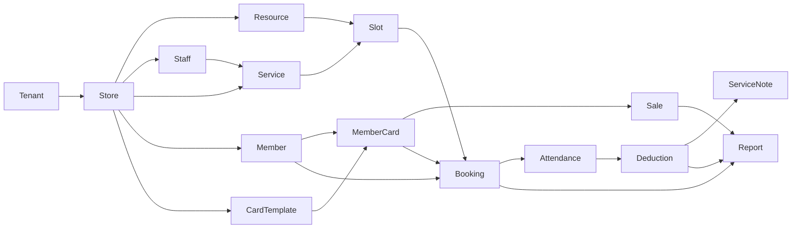

# 闲遇 MVP 数据库设计

文档日期：2026-06-07  
状态：active architecture  
范围：完整 MVP

## 1. 设计结论

PostgreSQL 是 MVP 唯一业务事实来源。数据库设计覆盖完整通用约课闭环：

数据模型不使用行业词，不保存平台支付订单，不保存上传文件，不依赖微信手机号。

## 2. 通用约定

### 2.1 主键与租户

- 主键推荐 PostgreSQL `bigint generated by default as identity`。
- 租户内业务表必须包含 `tenant_id`。
- 后端通过登录上下文注入 `tenant_id`，前端传入的租户 ID 不可信。
- 平台后台跨租户查询使用独立后台 API，不能复用租户端权限上下文。

### 2.2 通用字段

租户内业务表默认包含：

| 字段 | 类型 | 说明 |
| --- | --- | --- |
| `id` | bigint | 主键。 |
| `tenant_id` | bigint | 租户隔离字段。 |
| `created_at` | timestamptz | 创建时间。 |
| `updated_at` | timestamptz | 更新时间。 |
| `created_by_type` | varchar(32) | `owner`、`staff`、`member`、`admin`、`system`。 |
| `created_by_id` | varchar(80) | 操作主体 ID。 |
| `updated_by_type` | varchar(32) | 最近更新主体。 |
| `updated_by_id` | varchar(80) | 最近更新主体 ID。 |

软删除只用于需要保留历史关系的配置类数据。员工账号删除按产品要求为物理删除，但删除前必须校验关联服务项目、会员卡适用范围和未来排期。

### 2.3 金额与时间

- 金额使用 `numeric(12,2)`，展示单位为元。
- 预约、核销、审计时间使用 `timestamptz`。
- 有效期、营业日期类字段使用 `date`。
- 业务时区由后端统一处理，前端只负责展示。

## 3. 租户、后台和配置

### 3.1 `tenant`

| 字段 | 类型 | 说明 |
| --- | --- | --- |
| `id` | bigint | 租户 ID。 |
| `name` | varchar(120) | 租户名称。 |
| `status` | varchar(32) | `trialing`、`expiring`、`frozen`、`extended`。 |
| `trial_start_at` | timestamptz | 试用开始。 |
| `trial_end_at` | timestamptz | 试用结束。 |
| `freeze_reason` | varchar(500) nullable | 最近冻结原因。 |
| `frozen_at` | timestamptz nullable | 冻结时间。 |

租户只能由店长首次微信登录自动创建。平台后台不提供新建租户。

### 3.2 `admin_user`

| 字段 | 类型 | 说明 |
| --- | --- | --- |
| `id` | bigint | 后台账号 ID。 |
| `login_name` | varchar(80) unique | 登录账号。 |
| `password_hash` | varchar(255) | 密码哈希。 |
| `display_name` | varchar(80) | 展示名。 |
| `status` | varchar(32) | `active`、`disabled`。 |

### 3.3 `support_wechat_config`

| 字段 | 类型 | 说明 |
| --- | --- | --- |
| `id` | bigint | 配置 ID。 |
| `tenant_id` | bigint nullable | 为空表示默认客服微信。 |
| `wechat_id` | varchar(80) | 文本微信号。 |
| `display_text` | varchar(255) | 展示文案。 |
| `status` | varchar(32) | `active`、`disabled`。 |

不保存二维码或图片。

### 3.4 `platform_config`

| 字段 | 类型 | 说明 |
| --- | --- | --- |
| `config_key` | varchar(120) primary key | 配置键。 |
| `value_text` | varchar(255) | 配置值。 |
| `value_type` | varchar(32) | `integer`、`string`、`boolean`。 |
| `unit` | varchar(32) nullable | 天、分钟等。 |
| `description` | varchar(255) | 说明。 |
| `updated_at` | timestamptz | 更新时间。 |

至少包含：

- `tenant.trial.default_days`
- `tenant.trial.expiring_warn_days`
- `member.invite.default_valid_days`
- `booking.cancel.default_deadline_min`
- `member_card.expiring_warn_days`

### 3.5 `audit_log`

| 字段 | 类型 | 说明 |
| --- | --- | --- |
| `id` | bigint | 审计 ID。 |
| `tenant_id` | bigint nullable | 相关租户。 |
| `actor_type` | varchar(32) | `admin`、`owner`、`system`。 |
| `actor_id` | varchar(80) | 操作人或系统来源。 |
| `action` | varchar(80) | 动作。 |
| `target_type` | varchar(80) | 目标类型。 |
| `target_id` | varchar(80) | 目标 ID。 |
| `before_data` | jsonb nullable | 变更前。 |
| `after_data` | jsonb nullable | 变更后。 |
| `reason` | varchar(500) nullable | 原因。 |
| `created_at` | timestamptz | 时间。 |

## 4. 门店与开店

### 4.1 `administrative_city` 与 `administrative_district`

`administrative_city` 保存前端可直接选择的城市，字段包括 `code`、`name`、`sort_order`、`enabled`。`administrative_district` 保存区/县，字段包括 `code`、`city_code`、`name`、`sort_order`、`enabled`，并通过外键关联城市。两张表由 Flyway 基线在项目首次启动时初始化，业务运行时只读。

### 4.2 `store_onboarding_draft`

| 字段 | 类型 | 说明 |
| --- | --- | --- |
| `id` | bigint | 草稿 ID。 |
| `tenant_id` | bigint | 租户 ID。 |
| `owner_openid` | varchar(128) | 店长 openid。 |
| `store_profile_draft` | jsonb | 门店资料草稿。 |
| `business_hours_draft` | jsonb | 营业时间草稿。 |
| `resources_draft` | jsonb | 资源草稿。 |
| `completion_status` | jsonb | `store_profile_done`、`business_hours_done`、`resource_done`。 |
| `status` | varchar(32) | `draft`、`converted`。 |

### 4.3 `store`

| 字段 | 类型 | 说明 |
| --- | --- | --- |
| `id` | bigint | 门店 ID。 |
| `tenant_id` | bigint | 租户 ID。 |
| `name` | varchar(120) | 门店名称。 |
| `name_key` | varchar(120) | NFKC、空白折叠和大小写归一化后的全局唯一键。 |
| `business_categories` | jsonb | 1 到 6 个服务范围标签；API 字段为 `serviceScopes`。 |
| `city_code` | varchar(12) | 城市代码，关联 `administrative_city`。 |
| `district_code` | varchar(12) | 区/县代码，与 `city_code` 共同校验归属关系。 |
| `detail_address` | varchar(180) | 店长填写的详细地址。 |
| `address` | varchar(255) | 后端按城市、区/县和详细地址合成的展示地址。 |
| `contact_phone` | varchar(40) | 必填自由文本，不做格式或唯一性校验。 |
| `business_hours` | jsonb | 每周营业时间。 |

约束：`name_key` 全局唯一；`city_code` 必须存在，且 `(district_code, city_code)` 必须匹配同一条行政区划关系。

### 4.4 `resource`

| 字段 | 类型 | 说明 |
| --- | --- | --- |
| `id` | bigint | 资源 ID。 |
| `tenant_id` | bigint | 租户 ID。 |
| `store_id` | bigint | 门店 ID。 |
| `name` | varchar(80) | 资源名称。 |
| `resource_type` | varchar(80) | 房间、场地、床位、设备、工位或自定义。 |
| `capacity` | integer | 默认容量，最小为 1。 |
| `enabled` | boolean | 是否启用。 |
| `sort_order` | integer | 排序。 |

删除资源前必须校验未来排期、服务项目占用和至少 1 个启用资源。

## 5. 登录主体

### 5.1 `owner_wechat_identity`

| 字段 | 类型 | 说明 |
| --- | --- | --- |
| `id` | bigint | 身份 ID。 |
| `tenant_id` | bigint | 租户 ID。 |
| `openid` | varchar(128) unique | 店长 openid。 |
| `last_login_at` | timestamptz | 最近登录。 |
| `trial_notice_acknowledged_at` | timestamptz nullable | 新用户权益告示确认时间；为空时首次开店流程必须展示告示。 |

### 5.2 `member_wechat_identity`

| 字段 | 类型 | 说明 |
| --- | --- | --- |
| `id` | bigint | 身份 ID。 |
| `openid` | varchar(128) | 会员 openid。 |
| `member_id` | bigint nullable | 绑定后的会员 ID。 |
| `last_login_at` | timestamptz | 最近登录。 |

不通过微信授权手机号。

### 5.3 `staff_account`

| 字段 | 类型 | 说明 |
| --- | --- | --- |
| `id` | bigint | 员工账号 ID。 |
| `tenant_id` | bigint | 租户 ID。 |
| `store_id` | bigint | 门店 ID。 |
| `login_name` | varchar(80) | 登录账号。 |
| `password_hash` | varchar(255) | 密码哈希。 |
| `staff_name` | varchar(80) | 姓名。 |
| `role_label` | varchar(80) | 角色标签。 |
| `status` | varchar(32) | `active`、`disabled`。 |

### 5.4 `staff_profile`

| 字段 | 类型 | 说明 |
| --- | --- | --- |
| `id` | bigint | 资料 ID。 |
| `tenant_id` | bigint | 租户 ID。 |
| `staff_account_id` | bigint | 员工账号。 |
| `display_name` | varchar(80) | 展示名。 |
| `specialty_text` | varchar(255) | 擅长。 |
| `intro_text` | varchar(1000) | 简介。 |

只保存文字，不上传头像或资质文件。

## 6. 服务、会员卡和会员

### 6.1 `service_item`

| 字段 | 类型 | 说明 |
| --- | --- | --- |
| `id` | bigint | 服务 ID。 |
| `tenant_id` | bigint | 租户 ID。 |
| `store_id` | bigint | 门店 ID。 |
| `name` | varchar(120) | 服务名称。 |
| `service_type` | varchar(80) | 店长自填类型。 |
| `duration_min` | integer | 时长。 |
| `default_capacity` | integer | 默认容量。 |
| `deduct_count` | integer | 默认核销次数。 |
| `enabled` | boolean | 是否启用。 |
| `status` | varchar(32) | `draft`、`active`、`disabled`。 |

### 6.2 `service_resource_binding`

| 字段 | 类型 | 说明 |
| --- | --- | --- |
| `service_item_id` | bigint | 服务。 |
| `resource_id` | bigint | 资源。 |

### 6.3 `staff_service_binding`

| 字段 | 类型 | 说明 |
| --- | --- | --- |
| `staff_account_id` | bigint | 员工。 |
| `service_item_id` | bigint | 服务。 |

### 6.4 `card_template`

| 字段 | 类型 | 说明 |
| --- | --- | --- |
| `id` | bigint | 模板 ID。 |
| `tenant_id` | bigint | 租户 ID。 |
| `store_id` | bigint | 门店 ID。 |
| `name` | varchar(120) | 卡名。 |
| `card_type` | varchar(32) | `count`、`period`。 |
| `sale_price_yuan` | numeric(12,2) | 默认售价。 |
| `total_count` | integer nullable | 次数卡总次数。 |
| `valid_days` | integer nullable | 有效天数。 |
| `low_balance_threshold` | integer nullable | 低余额阈值。 |
| `status` | varchar(32) | `active`、`disabled`。 |

### 6.5 `card_template_service_scope`

| 字段 | 类型 | 说明 |
| --- | --- | --- |
| `card_template_id` | bigint | 卡模板。 |
| `service_item_id` | bigint | 适用服务。 |

### 6.6 `card_template_staff_scope`

| 字段 | 类型 | 说明 |
| --- | --- | --- |
| `card_template_id` | bigint | 卡模板。 |
| `staff_account_id` | bigint | 适用员工。 |

### 6.7 `member`

| 字段 | 类型 | 说明 |
| --- | --- | --- |
| `id` | bigint | 会员 ID。 |
| `tenant_id` | bigint | 租户 ID。 |
| `store_id` | bigint | 门店 ID。 |
| `name` | varchar(80) | 姓名。 |
| `member_no` | varchar(80) | 门店会员编号。 |
| `contact_text` | varchar(120) | 联系方式文本。 |
| `bind_status` | varchar(32) | `unbound`、`bound`。 |

### 6.8 `member_invite_code`

| 字段 | 类型 | 说明 |
| --- | --- | --- |
| `id` | bigint | 邀请码 ID。 |
| `tenant_id` | bigint | 租户 ID。 |
| `store_id` | bigint | 门店 ID。 |
| `member_id` | bigint | 会员 ID。 |
| `code_hash` | varchar(255) | 邀请码哈希。 |
| `display_code_tail` | varchar(16) | 尾号。 |
| `status` | varchar(32) | `active`、`used`、`expired`、`revoked`。 |
| `expires_at` | timestamptz | 过期时间。 |
| `bound_openid` | varchar(128) nullable | 绑定 openid。 |

### 6.9 `member_card`

| 字段 | 类型 | 说明 |
| --- | --- | --- |
| `id` | bigint | 会员卡 ID。 |
| `tenant_id` | bigint | 租户 ID。 |
| `store_id` | bigint | 门店 ID。 |
| `member_id` | bigint | 会员 ID。 |
| `template_id` | bigint | 模板 ID。 |
| `card_type` | varchar(32) | `count`、`period`。 |
| `sale_price_yuan` | numeric(12,2) | 本次发卡售价。 |
| `remain_count` | integer nullable | 剩余次数。 |
| `valid_from` | date | 生效日。 |
| `valid_until` | date | 到期日。 |
| `status` | varchar(32) | `active`、`low_balance`、`expiring`、`expired`、`empty`、`suspended`。 |

### 6.10 `offline_sale_record`

| 字段 | 类型 | 说明 |
| --- | --- | --- |
| `id` | bigint | 线下售卡记录。 |
| `tenant_id` | bigint | 租户 ID。 |
| `store_id` | bigint | 门店 ID。 |
| `member_id` | bigint | 会员 ID。 |
| `member_card_id` | bigint | 会员卡 ID。 |
| `sale_amount_yuan` | numeric(12,2) | 实收金额。 |
| `sale_date` | date | 售卡日期。 |
| `pay_method_label` | varchar(40) | 现金、微信线下、支付宝线下、其他。 |
| `operator_type` | varchar(32) | 操作人类型。 |
| `operator_id` | varchar(80) | 操作人。 |

不生成平台支付订单。

## 7. 排期、预约和履约

### 7.1 `bookable_slot`

| 字段 | 类型 | 说明 |
| --- | --- | --- |
| `id` | bigint | 时段 ID。 |
| `tenant_id` | bigint | 租户 ID。 |
| `store_id` | bigint | 门店 ID。 |
| `service_item_id` | bigint | 服务。 |
| `staff_account_id` | bigint | 员工。 |
| `resource_id` | bigint | 资源。 |
| `start_at` | timestamptz | 开始。 |
| `end_at` | timestamptz | 结束。 |
| `capacity` | integer | 容量。 |
| `reserved_count` | integer | 已预约数。 |
| `status` | varchar(32) | `draft`、`published`、`cancelled`、`disabled`。 |
| `cancel_deadline_min` | integer | 取消截止分钟数。 |

发布前必须预检服务、员工、资源、营业时间、容量和可用会员卡范围。

### 7.2 `booking`

| 字段 | 类型 | 说明 |
| --- | --- | --- |
| `id` | bigint | 预约 ID。 |
| `tenant_id` | bigint | 租户 ID。 |
| `store_id` | bigint | 门店 ID。 |
| `bookable_slot_id` | bigint | 时段。 |
| `member_id` | bigint | 会员。 |
| `member_card_id` | bigint | 使用会员卡。 |
| `status` | varchar(32) | `reserved`、`cancelled`、`arrived`、`deducted`、`note_done`。 |
| `reserved_at` | timestamptz | 预约时间。 |

### 7.3 `booking_waitlist`

| 字段 | 类型 | 说明 |
| --- | --- | --- |
| `id` | bigint | 候补 ID。 |
| `tenant_id` | bigint | 租户 ID。 |
| `store_id` | bigint | 门店 ID。 |
| `bookable_slot_id` | bigint | 时段。 |
| `member_id` | bigint | 会员。 |
| `status` | varchar(32) | `waiting`、`cancelled`。 |
| `created_at` | timestamptz | 候补时间。 |

候补不占名额、不自动补位、不扣卡。

### 7.4 `booking_cancel_record`

| 字段 | 类型 | 说明 |
| --- | --- | --- |
| `id` | bigint | 取消记录。 |
| `tenant_id` | bigint | 租户 ID。 |
| `booking_id` | bigint | 预约。 |
| `cancelled_by_type` | varchar(32) | `member`、`owner`、`system`。 |
| `cancelled_by_id` | varchar(80) | 操作人。 |
| `reason_text` | varchar(500) nullable | 原因。 |
| `created_at` | timestamptz | 取消时间。 |

### 7.5 `attendance_confirm`

| 字段 | 类型 | 说明 |
| --- | --- | --- |
| `id` | bigint | 到店确认。 |
| `tenant_id` | bigint | 租户 ID。 |
| `store_id` | bigint | 门店 ID。 |
| `booking_id` | bigint | 预约。 |
| `member_id` | bigint | 会员。 |
| `member_card_id` | bigint | 会员卡。 |
| `confirmed_by_staff_id` | bigint | 员工。 |
| `confirmed_at` | timestamptz | 到店时间。 |

### 7.6 `deduction_record`

| 字段 | 类型 | 说明 |
| --- | --- | --- |
| `id` | bigint | 核销记录。 |
| `tenant_id` | bigint | 租户 ID。 |
| `store_id` | bigint | 门店 ID。 |
| `booking_id` | bigint | 预约。 |
| `attendance_id` | bigint | 到店确认。 |
| `member_id` | bigint | 会员。 |
| `member_card_id` | bigint | 会员卡。 |
| `deduct_count` | integer | 扣减次数。 |
| `before_count` | integer nullable | 扣前次数。 |
| `after_count` | integer nullable | 扣后次数。 |
| `deducted_by_staff_id` | bigint | 核销员工。 |
| `deducted_at` | timestamptz | 核销时间。 |

### 7.7 `service_note`

| 字段 | 类型 | 说明 |
| --- | --- | --- |
| `id` | bigint | 记录 ID。 |
| `tenant_id` | bigint | 租户 ID。 |
| `booking_id` | bigint | 预约。 |
| `deduction_record_id` | bigint | 核销记录。 |
| `staff_note_text` | varchar(1000) nullable | 员工建议。 |
| `member_feedback_text` | varchar(1000) nullable | 会员反馈。 |

只保存文本。

## 8. 报表

MVP 报表优先实时查询，必要时使用快照。

### 8.1 查询来源

| 指标 | 来源 |
| --- | --- |
| 销售额 | `offline_sale_record` |
| 预约、取消、候补 | `booking`、`booking_cancel_record`、`booking_waitlist` |
| 到店 | `attendance_confirm` |
| 核销 | `deduction_record` |
| 低余额、到期、过期 | `member_card` + 平台配置阈值 |
| 服务表现 | `bookable_slot`、`booking`、`deduction_record` |

### 8.2 `report_snapshot`

| 字段 | 类型 | 说明 |
| --- | --- | --- |
| `id` | bigint | 快照 ID。 |
| `tenant_id` | bigint | 租户 ID。 |
| `store_id` | bigint | 门店 ID。 |
| `range_type` | varchar(32) | `day`、`month`。 |
| `range_start` | date | 开始。 |
| `range_end` | date | 结束。 |
| `snapshot_data` | jsonb | 指标数据。 |
| `created_at` | timestamptz | 生成时间。 |

## 9. 关键索引

- `tenant(status, trial_end_at)`
- `store(tenant_id)`
- `store(name_key)` 唯一
- `administrative_city(enabled, sort_order)`
- `administrative_district(city_code, enabled, sort_order)`
- `resource(tenant_id, store_id, enabled)`
- `staff_account(tenant_id, store_id, login_name)`
- `service_item(tenant_id, store_id, status)`
- `card_template(tenant_id, store_id, status)`
- `member(tenant_id, store_id, bind_status)`
- `member_invite_code(code_hash, status, expires_at)`
- `member_card(tenant_id, store_id, member_id, status)`
- `member_card(tenant_id, store_id, valid_until)`
- `offline_sale_record(tenant_id, store_id, sale_date)`
- `bookable_slot(tenant_id, store_id, start_at, status)`
- `booking(tenant_id, store_id, bookable_slot_id, status)`
- `booking(tenant_id, member_id, status)`
- `attendance_confirm(tenant_id, store_id, confirmed_at)`
- `deduction_record(tenant_id, store_id, deducted_at)`
- `audit_log(tenant_id, created_at)`

## 10. 事务与约束

- 发卡：创建 `member_card` 和 `offline_sale_record` 必须同事务。
- 预约：创建 `booking` 与增加 `reserved_count` 必须同事务。
- 取消：写 `booking_cancel_record`、更新 `booking.status`、释放名额必须同事务。
- 到店：同一预约不得重复到店确认。
- 核销：必须锁定 `member_card`，写核销记录并更新余额。
- 冻结：写租户状态和审计必须同事务。
- 平台配置：修改配置和审计必须同事务。
