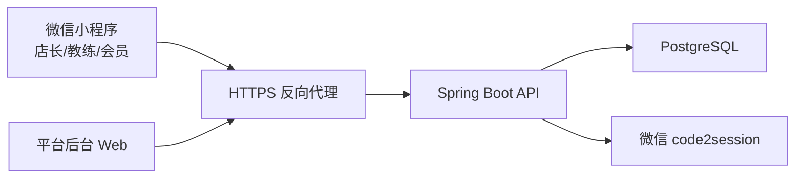

# 闲遇 MVP 部署映射

文档日期：2026-07-21
状态：active architecture  
范围：完整 MVP

## 1. 最终部署形态

MVP 部署分为两类：

- 微信小程序端：通过微信开发者工具和微信小程序后台上传、体验、审核、发布。
- 服务端和后台：使用 Docker + Docker Compose 部署 Spring Boot API、后台前端、PostgreSQL 和反向代理。



正式部署后的自动数据备份不纳入 MVP 当前范围。

## 2. 环境

| 环境 | 用途 | 要求 |
| --- | --- | --- |
| `local` | 本地开发 | Docker Compose 启动 PostgreSQL、API、后台前端和反向代理；微信登录仅使用 local 测试替身。 |
| `trial` | 试点体验 | 给体验版小程序、内部后台和真实试点门店使用。 |
| `prod` | 正式版本 | 小程序审核发布后的线上 API 和后台。 |

如果资源有限，`trial` 和 `prod` 可以共用同一台服务器，但必须使用不同环境变量、数据库 schema 或数据库实例隔离。

## 3. Docker Compose 服务

| 服务 | 说明 |
| --- | --- |
| `api` | Spring Boot 后端。 |
| `admin-web` | Vue 后台构建产物，由 Nginx 或静态服务托管。 |
| `postgres` | PostgreSQL。 |
| `nginx` | HTTPS、静态资源、API 反向代理。 |

不包含独立缓存服务、消息队列、对象存储或文件服务。

## 4. 域名与 HTTPS

当前阶段一 Compose 提供 HTTP 试点技术验收入口；真实设备试点和正式发布前必须由部署环境终止 HTTPS，并使用微信合法域名。推荐：

- `api.example.com`：后端 API。
- `admin.example.com`：平台后台。

Nginx 推荐规则：

- `/api/` 转发到 Spring Boot。
- `/` 服务后台前端。
- 静态资源启用合理缓存。
- API 响应透传或生成 `X-Request-Id`。

## 5. 后端环境变量

| 变量 | 说明 |
| --- | --- |
| `SPRING_PROFILES_ACTIVE` | `local`、`trial`、`prod`。 |
| `SEREN_MEET_DB_URL` | PostgreSQL JDBC 地址。 |
| `SEREN_MEET_DB_USER` | 数据库用户名。 |
| `SEREN_MEET_DB_PASSWORD` | 数据库密码，无默认值。 |
| `SEREN_MEET_BOOTSTRAP_ADMIN_USERNAME` | 首个管理员用户名，仅空表引导时使用。 |
| `SEREN_MEET_BOOTSTRAP_ADMIN_PASSWORD` | 首个管理员密码，至少 12 位，无默认值。 |
| `SEREN_MEET_BOOTSTRAP_ADMIN_DISPLAY_NAME` | 首个管理员显示名。 |
| `SEREN_MEET_OWNER_WECHAT_APP_ID` | 店长端小程序 AppID。 |
| `SEREN_MEET_OWNER_WECHAT_APP_SECRET` | 店长端小程序 AppSecret。 |
| `SEREN_MEET_MEMBER_WECHAT_APP_ID` | 会员端小程序 AppID。 |
| `SEREN_MEET_MEMBER_WECHAT_APP_SECRET` | 会员端小程序 AppSecret。 |

员工端使用账号密码登录，不需要微信凭据。`trial` 和 `prod` 必须注入真实店长端、会员端 AppID/Secret；local/test profile 才会启用微信测试替身。

从 `infra/compose/.env.example` 创建不提交仓库的 `infra/compose/.env` 后启动：

```bash
./scripts/compose-up.sh
```

入口默认是 `http://127.0.0.1:8088`，API 对外路径以 `/api` 开头。

## 6. 数据库迁移

- 使用 Flyway。
- 迁移脚本随代码提交。
- 应用启动时执行迁移或由部署命令显式执行迁移。
- 禁止在试点或正式环境手工改表后不提交迁移脚本。

当前 V1 是基于“无存量 trial/prod 数据”的完整基线重写。仓库不会自动删除数据库或卷。如需在确认无保留数据后显式重建本机试验库：

```bash
docker compose --env-file infra/compose/.env -f infra/compose/docker-compose.yml down
docker volume rm seren-meet_seren_meet_pg_data
./scripts/compose-up.sh
```

第二条命令会永久删除该 Compose 项目的 PostgreSQL 数据，只能在人工核对卷名并确认无需保留数据后执行。

## 7. 小程序发布

小程序不通过 Docker 发布。推荐流程：

1. 注册微信小程序并获取 AppID。
2. 在微信公众平台配置服务器域名。
3. 本地使用微信开发者工具调试。
4. 构建 Taro 微信小程序产物。
5. 上传体验版。
6. 体验成员验证店长、教练、会员三端主流程。
7. 提交审核。
8. 审核通过后发布。

本地开发者工具可使用默认的 `http://127.0.0.1:8080`。真机预览不能使用该地址，因为真机上的回环地址指向手机自身；生成店长端真机预览包时必须显式传入已配置为微信 request 合法域名的 HTTPS API 地址：

```bash
TARO_APP_API_BASE_URL=https://api.example.com npm run build:weapp:preview --workspace @serenmeet/miniprogram-owner
```

试点服务端同时必须使用 `trial` profile，并注入与 `apps/miniprogram-owner/project.config.json` 中 AppID 匹配的 `SEREN_MEET_OWNER_WECHAT_APP_ID` 和对应 AppSecret。AppSecret 只能存在于服务端部署环境，不得写入小程序、构建产物或仓库。

微信开发者工具的“真机调试”可在同一可信局域网内连接本机 API。将 `apps/miniprogram-owner/.env.example` 复制为 `.env`，填写 Mac 当前局域网地址后执行：

```bash
npm run build:weapp:device --workspace @serenmeet/miniprogram-owner
```

该方式只用于开发者身份的真机调试；体验版、预览版、trial 和 prod 仍必须使用微信合法 HTTPS 域名。

后续可接入微信官方 `miniprogram-ci` 自动预览和上传，但 MVP 可以先手动上传。

## 8. 后台前端发布

后台前端构建为静态资源：

1. 安装依赖。
2. 执行类型检查和构建。
3. 将 `dist` 放入 `admin-web` 镜像或 Nginx 静态目录。
4. 配置 API base URL。
5. 验证 1024px、1280px、1440px、1920px 和宽表格。

## 9. 运维边界

MVP 必须具备：

- 健康检查。
- 应用日志。
- 请求 ID。
- 数据库迁移。
- 环境变量配置。
- 后台登录保护。

MVP 不包含：

- 自动数据备份。
- 多地域容灾。
- 自动扩缩容。
- Kubernetes。
- 蓝绿发布。
- 对象存储。
- 文件上传服务。
