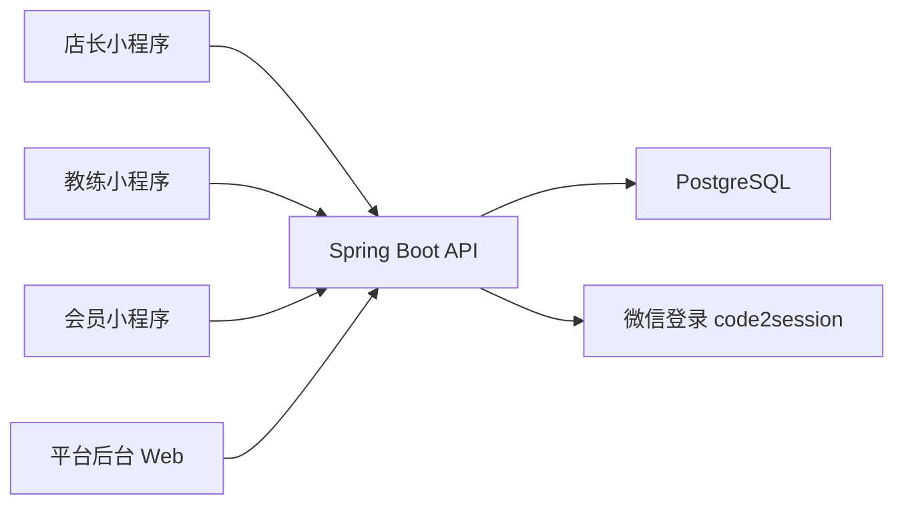
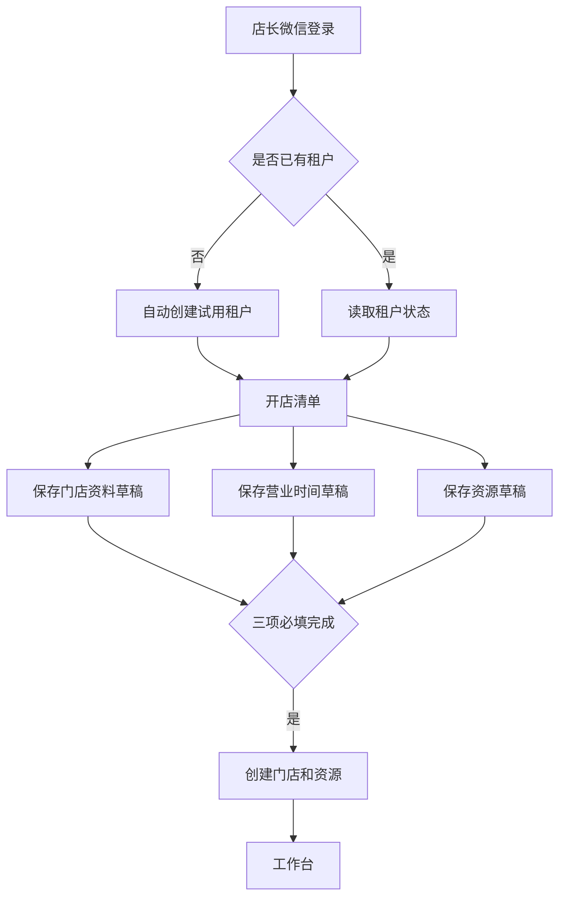
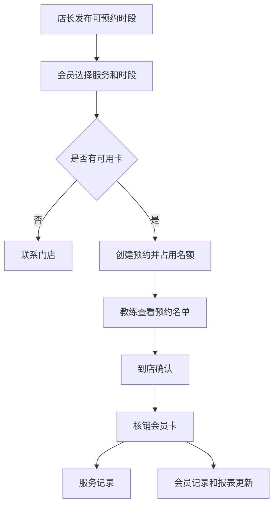

# 闲遇 MVP 完整工程设计

文档日期：2026-06-07  
状态：active architecture  
范围：完整 MVP

## 1. 系统目标

闲遇 MVP 是面向多业态预约制门店的通用约课 SaaS。工程设计必须覆盖完整 MVP，而不是只覆盖试点优先路径。

系统需要支持：

- 店长小程序：开店、资源、员工、服务、会员卡、会员、排期、报表、冻结续期入口。
- 教练小程序：账号登录、资料、今日服务、预约名单、到店、核销、服务记录、冻结提示。
- 会员小程序：微信登录、邀请码绑定、卡包、约课、候补、取消、服务记录、冻结提示。
- 平台后台：租户、期限、冻结、解冻、客服微信、平台配置、操作记录。

系统明确不支持：线上支付、微信授权手机号、文件上传、会员自助购卡、员工自助注册。

## 2. 总体架构

后端为单体应用，按业务域拆包。所有端共用同一 API 服务，依赖登录主体和权限上下文隔离访问能力。PostgreSQL 是唯一事实来源。

## 3. 后端业务域

| 业务域 | 职责 |
| --- | --- |
| `auth` | 店长/会员微信登录，教练/后台账号密码登录，token 签发与失效。 |
| `tenant` | 租户自动开通、试用状态、过期自动冻结、手动冻结、延期并解冻。 |
| `admin` | 平台后台账号、客服微信、平台配置、租户运营视图。 |
| `audit` | 自动开通、冻结、延期并解冻、配置修改等操作记录。 |
| `onboarding` | 首次开店草稿、必填项完成状态、创建门店。 |
| `store` | 门店资料、经营项目、服务标签、营业时间。 |
| `resource` | 资源新增、修改、删除、停用、排序、容量。 |
| `staff` | 教练账号、资料、状态、删除校验。 |
| `service` | 服务项目、适用资源、可履约员工、启用规则。 |
| `card` | 会员卡模板、会员持卡、状态、适用范围、提醒阈值。 |
| `member` | 会员档案、邀请码、绑定。 |
| `sale` | 线下售卡记录、发卡事务。 |
| `schedule` | 可预约时段、草稿、预检、发布、复制。 |
| `booking` | 预约、候补、取消、预约详情。 |
| `fulfillment` | 到店确认、核销、服务记录。 |
| `report` | 销售、预约、到店、核销、会员卡提醒和明细。 |

## 4. 核心业务流

### 4.1 店长开店与配置

创建门店必须由服务端最终校验，不能依赖前端页面栈。

### 4.2 预约和履约

核销必须发生在到店确认之后。核销记录是报表来源，不能从会员卡余额倒推。

### 4.3 候补和取消

满员时可记录候补意向，但不占名额、不自动补位、不扣卡。取消预约必须校验取消截止时间和租户状态，取消成功释放名额；超过规则或租户冻结时进入阻断态。

### 4.4 冻结和恢复

租户冻结后：

- 店长端只能进入冻结页。
- 教练端名单、到店、核销、记录不可用。
- 会员端约课、取消、候补不可用，只能查看只读卡包摘要。
- 后台延长期限并解冻后，三端恢复。

系统定时检查已过期且尚未冻结的租户，并自动置为冻结状态、写入系统审计记录。

冻结不删除门店、会员卡、预约、售卡、核销或报表数据。

## 5. 四端页面到工程模块映射

### 5.1 店长小程序

| 页面 | 模块 |
| --- | --- |
| O-LOGIN | `auth`、`tenant` |
| O-START、O-STORE、O-HOURS、O-RESOURCE | `onboarding`、`store`、`resource` |
| O-DASHBOARD | `report`、`schedule`、`booking`、`card`、`fulfillment` |
| O-STAFF | `staff` |
| O-SERVICE | `service`、`resource`、`staff` |
| O-CARD | `card` |
| O-MEMBER、O-MEMBER-HOME | `member`、`card`、`sale` |
| O-SCHEDULE、O-SCHEDULE-HOME | `schedule`、`service`、`resource`、`staff` |
| O-REPORT、O-REPORT-DETAIL | `report` |
| O-MY | `store`、`tenant` |
| O-FROZEN | `tenant`、`admin` |

### 5.2 教练小程序

| 页面 | 模块 |
| --- | --- |
| S-LOGIN、S-ACCOUNT | `auth`、`staff` |
| S-PROFILE、S-MY | `staff`、`store` |
| S-TODAY、S-TODAY-EMPTY | `schedule`、`booking` |
| S-ROSTER | `booking`、`card` |
| S-ATTEND | `fulfillment` |
| S-DEDUCT、S-DEDUCT-BLOCK | `fulfillment`、`card` |
| S-NOTE | `fulfillment` |
| S-FROZEN | `tenant` |

### 5.3 会员小程序

| 页面 | 模块 |
| --- | --- |
| M-LOGIN | `auth` |
| M-BIND、M-BIND-LOADING、M-BIND-CHECK、M-BIND-FAIL | `member`、`store`、`card` |
| M-HOME、M-CARDS | `member`、`card`、`fulfillment` |
| M-SERVICES、M-DETAIL、M-NO-CARD | `service`、`schedule`、`card` |
| M-CONFIRM、M-SUCCESS | `booking`、`card` |
| M-WAITLIST | `booking` |
| M-BOOKINGS、M-BOOKING-DETAIL | `booking`、`fulfillment` |
| M-CANCEL、M-CANCEL-BLOCK | `booking`、`tenant` |
| M-RECORD | `fulfillment` |
| M-MY | `member`、`store` |
| M-FROZEN | `tenant` |

### 5.4 平台后台

| 页面 | 模块 |
| --- | --- |
| A-LOGIN | `auth`、`admin` |
| A-TENANTS | `tenant`、`report` |
| A-TENANT-DETAIL | `tenant`、`store`、`report` |
| A-FREEZE | `tenant`、`audit` |
| A-EXTEND | `tenant`、`audit` |
| A-SUPPORT | `admin` |
| A-CONFIG、A-CONFIG-EDIT | `admin`、`audit` |
| A-AUDIT | `audit` |

## 6. 权限模型

| 角色 | 允许 |
| --- | --- |
| StoreOwner | 当前租户门店配置、员工、服务、会员卡、会员、排期、报表、客服微信查看。 |
| Staff | 当前门店下自己的排期、名单、到店、核销、服务记录和个人资料。 |
| Member | 自己绑定的门店、卡包、预约、候补、取消和记录。 |
| PlatformAdmin | 租户状态、冻结、解冻、期限、客服微信、平台配置和审计。 |

平台后台不得代门店创建会员、发卡、核销或处理支付。

## 7. 设计落地约束

小程序端必须验证 320px、375px、390px、430px，后台端必须验证 1024px、1280px、1440px、1920px 和宽表格。表单、反馈、空态、阻断态和禁用原因按原型说明统一实现。
