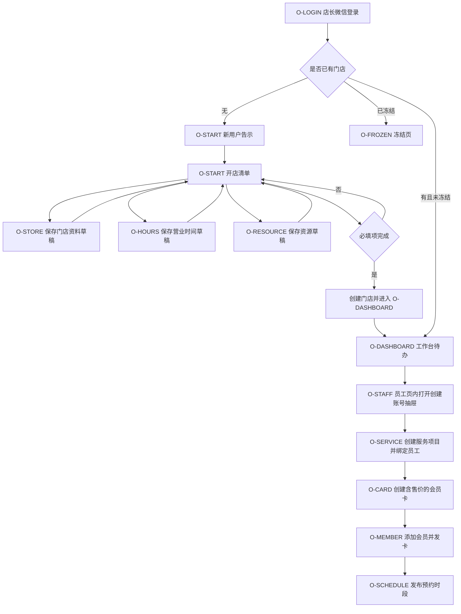
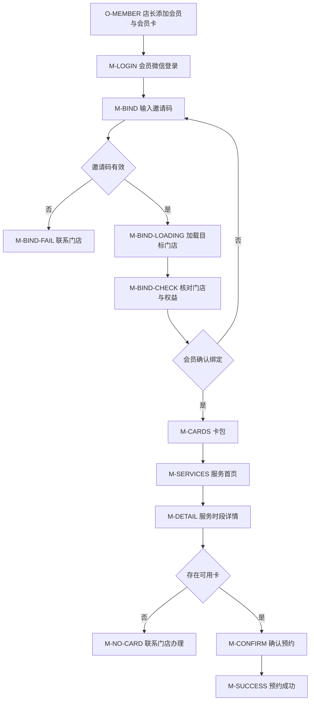
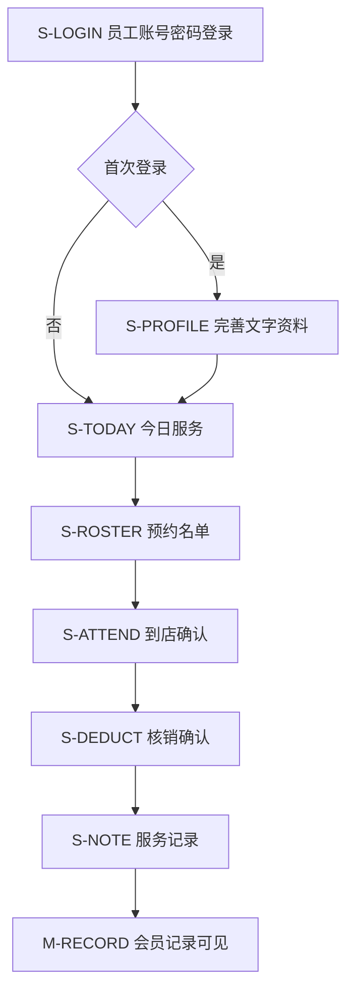
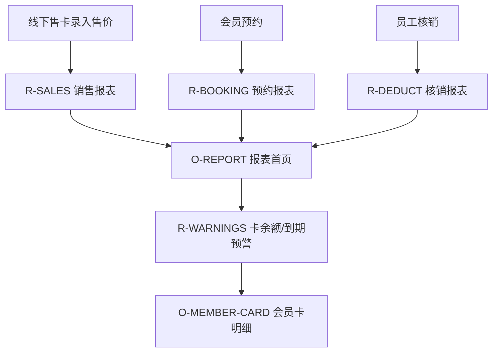
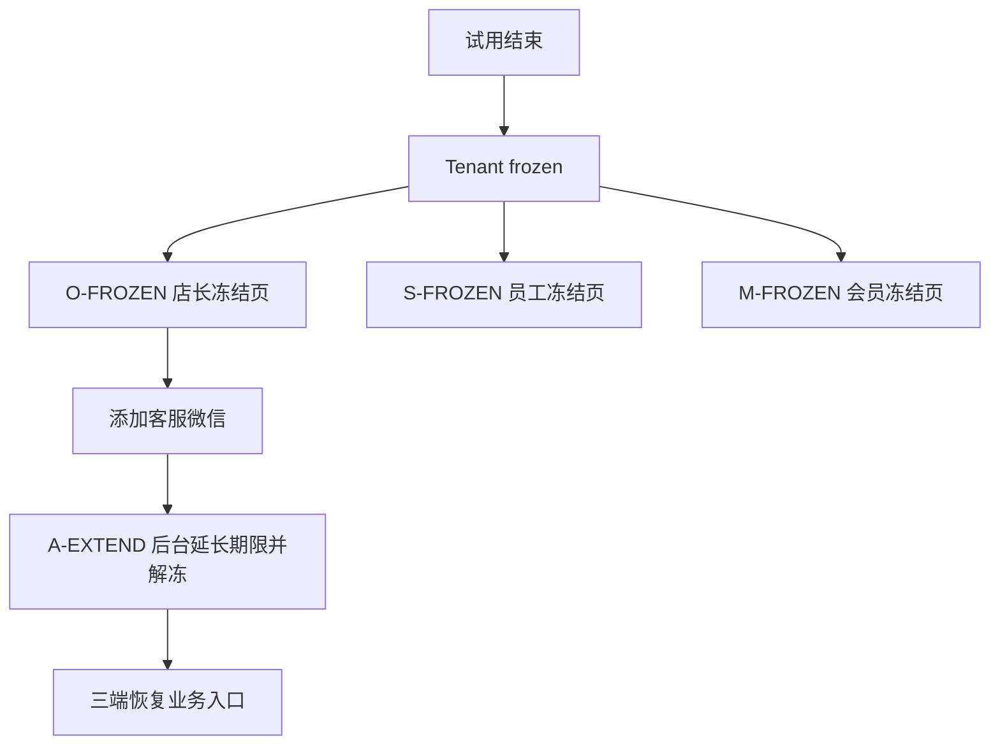
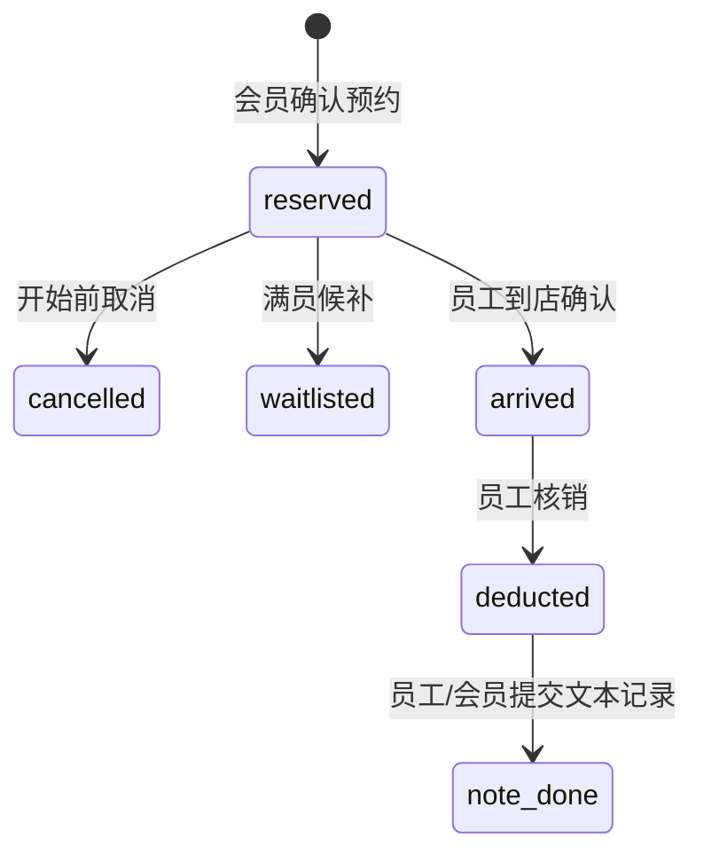

# 闲遇 Product Spec

版本：MVP  
文档日期：2026-05-30  
版本原型：`../../../design-docs/versions/mvp/prototype.html`  
文档性质：开发可执行产品规格，页面、字段、操作、状态与原型一一对应

## 0. 读取规范

- MVP 是当前唯一正式版本包。开发、验收和评审只读取本目录文档与 `../../../design-docs/versions/mvp/prototype.html`。
- 产品设计、实现和验收均以当前 MVP 版本包为准。
- 本文不引用其他版本资料作为实现前提。

## 1. 产品定位

闲遇 MVP 是面向多业态门店的通用约课 SaaS。平台服务对象是门店店长，门店服务对象是会员，门店履约人员可以是教练、老师、技师、顾问、康复师或其他服务人员。

只要门店业务满足以下模型，即可进入 MVP：

通用抽象：

- `ServiceItem`：服务项目。可表现为课程、服务、场地预约、私教时段、小班课、固定班等。
- `Resource`：承载履约的资源。默认类型为房间、场地、床位、设备、工位，并支持门店自定义类型。
- `StaffAccount`：履约人员账号。可为教练、老师、技师、康复师、服务员。
- `EntitlementCard`：会员卡权益。MVP 仅保留次数卡和期限卡，新增售价字段。
- `BookableSlot`：可预约时段。由服务项目、员工、资源、时间、容量、预约规则组成。
- `Booking`：预约记录。会员预约后占用名额，到店后核销权益。

## 2. 调研结论

同类产品和通用预约系统的共同规律：

| 来源 | 观察 | MVP 采纳 |
| --- | --- | --- |
| Acuity Scheduling | 通用预约系统通常用 appointment type、staff、calendar、package code 支撑服务预约和套餐抵扣 | MVP 将课程抽象为服务项目，会员卡作为门店发放的权益，不做线上购买 |
| Glofox | 健身/工作室系统常同时覆盖 class booking、memberships、check-ins、reporting | MVP 保留预约、会员卡、到店确认、核销和报表，不做会员自助支付 |
| Momoyoga | 工作室运营关注 class passes、memberships、bookings、teacher/class type 维度洞察 | MVP 报表提供销售额、核销、预约、会员卡余额和到期预警 |
| 魔方约课 | 会员卡可按课程、老师、门店设置适用范围，统计报表覆盖销售、会员、教学、消课 | MVP 会员卡支持适用服务、适用员工、次数/期限、售价、余额预警 |
| 酷课约课/快约 | 约课可抽象为团课、私教、服务、场地；排期可配置可用会员卡、容量、预约价格 | MVP 用服务类型 + 资源类型支持多业态，不把行业字段写死 |
| 约刻系统 | 门店、教室、课程、老师、会员、会员卡、约课、数据统计是基础骨架 | MVP 将这些能力收敛为通用门店预约骨架 |
| 松果约课 | 会员卡、排课、约课、员工和报表是线下场馆数字化基础 | MVP 保留卡片式会员卡体验和店长经营报表 |

调研来源：

- Acuity Scheduling：`https://www.acuityscheduling.com/`
- Acuity packages 文档：`https://help.acuityscheduling.com/hc/en-us/articles/16676947677325-Packages-gift-certificates-and-subscriptions-overview`
- Glofox：`https://www.glofox.com/business-types/gym-management-software/`
- Glofox reports：`https://support.glofox.com/hc/en-us/sections/360001278137-Reports`
- Momoyoga insights：`https://support.momoyoga.com/en/support/solutions/articles/201000128084-gather-important-insights-with-momoyoga`
- 魔方约课：`https://yqdicloud.com/`
- 酷课约课：`https://kukecloud.com/`
- 酷课快约：`https://fw.kukecloud.com/`
- 约刻系统：`https://www.jkyueke.com/`
- 松果约课：`https://songguoyueke.com/`

## 3. MVP 范围

### 3.1 包含

- 三个小程序端：店长端、员工端、会员端。
- 平台内部后台：只用于租户试用、冻结、人工续期、客服微信配置。
- 店长和会员微信一键登录，仅识别 openid，不获取微信绑定手机号。
- 员工端账号密码登录，账号由店长创建。
- 店长首次微信登录自动开通试用租户、试用到期冻结、添加客服微信人工续期。
- 门店建档：门店名称、经营项目、服务标签、地址、联系电话、营业时间、资源。
- 资源管理：资源名称、类型、容量、启用状态、排序。
- 服务项目管理：服务名称、服务类型、时长、默认容量、核销规则、适用资源、可履约员工。
- 员工管理：创建账号、复制账号信息、修改账号资料、修改密码、启用、停用、删除账号；删除前必须校验关联服务项目和未来排期。
- 会员卡管理：卡名、卡类型、售价、次数或有效期、适用服务、适用员工、核销规则、提醒阈值；MVP 不提供组合卡。
- 会员管理：创建会员、生成邀请码、线下售卡录入、发放会员卡。
- 排期：按服务、员工、资源、时间、容量发布可预约时段，支持草稿、预检、复制。
- 会员约课：绑定邀请码、查看卡包、筛选服务、选择可用会员卡预约、取消、候补。
- 员工履约：查看今日服务、预约名单、到店确认、核销确认、服务记录。
- 报表：本月和历史销售额、会员卡销售明细、预约/到店/核销数据、会员卡余额不足和即将到期预警。

### 3.2 明确不包含

- 微信授权手机号。
- 平台内线上支付、微信支付、收款码、自动续费、退款、分账、发票。
- 会员端自助购卡、在线充值、在线续费。
- 任何文件上传，包括图片、头像、资质、附件、二维码上传。
- 复杂营销：优惠券、拼团、砍价、分销、积分商城。
- 复杂集团多门店权益。
- 员工薪酬结算和财务对账。
- AI 排课、智能推荐、复杂风控。

## 4. 角色、权限与端

| 端 | 角色 | 登录方式 | 允许操作 | 不允许操作 |
| --- | --- | --- | --- | --- |
| 店长小程序 | StoreOwner | 微信一键登录 | 建店、配置服务/资源/员工/会员卡/会员/排期、录入线下售卡、查看报表、联系客服续期 | 授权手机号、线上收款、上传文件、员工薪酬 |
| 员工小程序 | Staff | 账号密码登录 | 完善文字资料、查看自己服务、名单、到店确认、核销、服务记录 | 自助注册、建店、编辑会员卡、查看全店财务 |
| 会员小程序 | Member | 微信一键登录 | 邀请码绑定、查看卡包、约课、取消、候补、查看记录 | 自助购卡、在线支付、跨店使用未授权权益、上传文件 |
| 平台后台 | PlatformAdmin | 账号密码登录 | 查看已开通租户、冻结账户、延期并解冻、配置客服微信 | 新建租户、处理会员支付、门店售卡交易、上传附件 |

## 5. 核心实体

| 实体 | 必要字段 | 说明 |
| --- | --- | --- |
| Tenant | `id`、`name`、`status`、`trial_start_at`、`trial_end_at`、`support_wechat_id` | SaaS 租户 |
| StoreOnboardingDraft | `id`、`tenant_id`、`owner_openid`、`store_profile_draft`、`business_hours_draft`、`resources_draft`、`completion_status`、`updated_at` | 首次开店草稿，用于 O-START 清单式引导 |
| Store | `id`、`tenant_id`、`name`、`business_categories`、`service_tags`、`address`、`contact_phone`、`business_hours` | 门店 |
| Resource | `id`、`store_id`、`name`、`resource_type`、`capacity`、`enabled`、`sort_order` | 房间/场地/床位/设备/工位，可自定义 |
| ServiceItem | `id`、`store_id`、`name`、`service_type`、`duration_min`、`default_capacity`、`deduct_count`、`enabled` | 通用服务项目 |
| StaffAccount | `id`、`store_id`、`login_name`、`initial_password`、`staff_name`、`role_label`、`status` | 员工登录账号 |
| StaffProfile | `id`、`staff_account_id`、`display_name`、`specialty_text`、`intro_text`、`status` | 员工文字资料，不含头像上传 |
| StaffServiceBinding | `staff_account_id`、`service_item_id` | 员工可履约服务 |
| CardTemplate | `id`、`store_id`、`name`、`card_type`、`sale_price_yuan`、`total_count`、`valid_days`、`service_scope`、`staff_scope`、`low_balance_threshold` | 会员卡模板 |
| Member | `id`、`store_id`、`name`、`member_no`、`contact_text`、`bind_status` | 门店会员档案 |
| MemberInviteCode | `id`、`store_id`、`member_id`、`code`、`status`、`expires_at` | 会员邀请码 |
| MemberCard | `id`、`member_id`、`template_id`、`sale_price_yuan`、`remain_count`、`valid_until`、`status` | 会员持有权益 |
| OfflineSaleRecord | `id`、`member_card_id`、`sale_amount_yuan`、`sale_date`、`pay_method_label`、`operator_id` | 店长线下售卡记录 |
| BookableSlot | `id`、`service_item_id`、`staff_account_id`、`resource_id`、`start_at`、`end_at`、`capacity`、`status` | 可预约时段 |
| Booking | `id`、`bookable_slot_id`、`member_id`、`member_card_id`、`status` | 预约 |
| AttendanceConfirm | `booking_id`、`confirmed_by`、`confirmed_at` | 到店确认 |
| DeductionRecord | `booking_id`、`member_card_id`、`deduct_count`、`before_count`、`after_count` | 核销记录 |
| ServiceNote | `booking_id`、`member_feedback_text`、`staff_note_text`、`created_by` | 服务记录与反馈，纯文本 |
| ReportSnapshot | `store_id`、`range_type`、`sales_amount`、`booking_count`、`deduct_count`、`warning_count` | 报表聚合 |

## 6. 经营项目与服务标签

经营项目与服务标签由店长自行填写，不使用系统预置行业枚举或推荐标签。两个字段用于门店资料展示、会员理解服务方向和服务筛选提示，不限制服务项目名称和类型。

规则：

- `Store.business_categories` 由店长填写 1 到 4 个短标签，例如“康复理疗、儿童体适能、咨询评估”。
- `Store.service_tags` 由店长填写 1 到 10 个短标签，例如“姿态评估、一对一服务、小组训练”。
- 每个标签建议 2 到 8 个字，页面必须提供填写指导和示例。
- 经营项目和服务标签仅作用于当前门店。
- 服务项目可自由命名，不因经营项目限制。
- MVP 不提供经营项目多选、推荐标签、行业模板或文件上传。

## 7. 核心业务故事

### 7.1 故事 A：店长完成通用门店启用

关键规则：

- 新租户由店长首次微信登录时自动创建，初始状态为 `trialing`，并进入 O-START 开店清单；平台后台不提供人工新建租户入口。
- 首次启用必须完成门店资料、营业时间和至少 1 个启用资源。
- 首次开店采用 O-START 清单式引导。创建门店按钮默认禁用；门店资料、营业时间和履约资源三个必填项全部保存并校验通过后，按钮变为可点击。
- O-STORE、O-HOURS 和 O-RESOURCE 在首次开店期间保存到开店草稿，保存成功后返回 O-START 更新完成状态；不再依赖小程序前端连续自动跳转完成向导。
- 点击创建门店时，后端必须对开店草稿做最终校验，成功后一次性创建 `Store` 和至少 1 个启用 `Resource`，并跳转 O-DASHBOARD。
- 门店资料中的经营项目和服务标签由店长自行填写，保存后用于员工端和会员端的门店资料卡展示。
- 员工、服务、会员卡、会员、排期可以分步完成；未完成时由工作台持续展示待办，我的页仅保留长期设置和管理入口。
- 服务项目创建时如无员工，可保存草稿但不能发布可预约时段。
- 会员卡必须录入 `sale_price_yuan`，允许为 0；售价用于报表，不代表平台收款。
- 会员卡必须绑定适用服务范围；会员约课只能使用适用、未过期、余额足够的卡。

### 7.2 故事 B：会员绑定后预约任意服务

关键规则：

- 会员端不能自助购卡，不能线上支付。
- 邀请码由门店生成，过期或已使用时进入失败页。
- 会员在 M-BIND 填写邀请码后，点击“查询门店信息”只触发邀请码校验和门店资料加载，不直接完成绑定。
- 邀请码校验期间展示 M-BIND-LOADING 加载态，明确告知正在校验有效期、绑定状态和可绑定会员卡；校验失败进入 M-BIND-FAIL。
- 邀请码有效时进入 M-BIND-CHECK，必须展示目标门店资料、会员姓名和可绑定会员卡权益；只有会员点击“确认绑定”后，才绑定门店会员身份和会员卡权益并进入卡包。
- M-BIND-CHECK 必须提供返回修改入口；会员发现门店、姓名或会员卡不一致时，可返回重新输入或联系门店，不应强制绑定。
- 会员绑定前必须能核对目标门店完整资料，绑定后必须能在卡包或约课首页查看门店资料摘要；摘要至少包含门店名称、地址、联系电话、营业时间、经营项目和服务标签。
- 会员可按日期、服务类型、员工、可预约状态筛选。
- 满员可进入候补；MVP 候补只记录意向，不自动补位。
- 开始前可按门店取消规则取消，取消后释放名额，不产生核销。

### 7.3 故事 C：员工完成履约与核销

关键规则：

- 员工不能自助注册。
- 员工登录归属门店后必须能查看门店资料摘要，包括门店名称、地址、联系电话、营业时间、经营项目和服务标签。
- 员工只能看自己被排入的服务时段和名单。
- 核销前必须到店确认。
- 核销成功后写入会员卡明细、会员记录和报表。
- 服务记录只支持文本，不支持图片或文件。

### 7.4 故事 D：店长查看报表并处理预警

关键规则：

- 销售额来自店长录入的线下售卡记录，不代表平台收款。
- 报表支持本月、上月、自定义月份、全部历史。
- 预警包括剩余次数低于阈值、有效期 14 天内到期和已过期。
- 报表首页优先呈现销售额、预约、到店、核销四个结果；售卡明细、预约到店、服务表现和会员卡提醒作为店长可理解的入口呈现，低余额、即将到期和已过期进入“今天先处理”。

### 7.5 故事 E：试用冻结与人工续期

## 8. 页面契约

### 8.1 店长小程序

| 页面 ID | 原型标题 | 入口 | 前置条件 | 核心信息 | 主操作 | 异常/空态 |
| --- | --- | --- | --- | --- | --- | --- |
| O-LOGIN | 店长端 / 微信登录 | 打开店长小程序 | 未登录 | 端标识、试用说明、多业态说明、微信登录 | 微信一键登录 | 微信授权失败重试 |
| O-START | 店长端 / 开始使用 | 首次登录无门店 | 已登录 | 新用户免费试用告示、当前试用天数、开店清单、门店资料/营业时间/履约资源三个必填项完成状态、员工与服务等可稍后项、创建门店按钮禁用/可用状态、必填项完成后的门店展示预览 | 我知道了/点击必填项/创建门店 | 必填项未完成时创建门店禁用并提示剩余项；当前默认试用天数为 30 天，由平台配置决定 |
| O-STORE | 店长端 / 门店资料 | 开始使用清单/我的 | 未冻结 | 门店名称、自填经营项目、自填服务标签、地址、电话、填写指导；门店名称、地址、电话、经营项目和服务标签用红色必填标记，不展示开店进度或已填数量卡片 | 保存并返回清单 | 必填缺失、标签超限、电话格式错误 |
| O-HOURS | 店长端 / 营业时间 | 开始使用清单/门店资料 | 未冻结 | 星期、营业/休息、开始结束时间、周末单独设置逻辑；不展示开店必填、已营业、可预约统计卡片；周一至周日全选时隐藏周末设置，周一至周五时展示周末设置并支持分别配置周六/周日 | 保存并返回清单 | 结束早于开始禁止保存 |
| O-RESOURCE | 店长端 / 资源管理 | 开始使用清单/我的 | 开店草稿或 Store 存在 | 首次引导新增资源底部抽屉态、保存后资源列表态、资源名称、资源类型、容量、启用状态只读标识、排序；资源类型固定项为房间、场地、床位、设备、工位，并支持自定义 | 保存资源/新增/修改/删除/停用/完成并返回清单 | 至少 1 个启用资源；删除进入 O-RESOURCE-DELETE 二次确认 |
| O-RESOURCE-DELETE | 店长端 / 资源删除确认 | 资源列表删除入口 | 未冻结且资源存在 | 待删除资源名称、类型、容量、启用状态、关联未来排期/服务项目校验结果、删除影响说明 | 确认删除/取消 | 有未来排期或导致启用资源少于 1 个时禁用确认；删除中禁用重复提交；失败保留确认态并展示原因 |
| O-STAFF | 店长端 / 员工 | 工作台待办/我的员工 | Store 存在 | 员工列表展示账号启用数、停用数、今日服务数，不展示待完善状态统计；仅员工列表行提供复制账号入口，复制员工姓名和登录账号供店长手动分享给教练；点击员工行在当前页打开修改员工底部抽屉，抽屉承接同一员工并提供账号/角色修改、密码修改、启用/停用、删除账号；新增员工抽屉和修改员工抽屉均不提供复制账号操作；删除账号前校验是否关联服务项目、会员卡适用范围、未来排期等项目 | 新增员工/创建账号/列表复制账号/打开修改抽屉/保存修改/启用/停用/删除账号/关闭抽屉 | 账号重复、密码不合规、复制失败、无员工引导创建；有关联项目时删除账号禁用并提示先解除关联 |
| O-SERVICE | 店长端 / 服务项目 | 工作台/我的 | Store 存在 | 名称、类型、时长、容量、核销次数、适用资源、可履约员工；从店长创建服务的真实场景出发，先填写会员可见服务，再用下拉多选选择适用资源和可履约员工；无员工阻断态展示可保存草稿但不可启用和排期 | 保存服务/保存草稿/下拉多选资源/下拉多选员工 | 无员工时只能草稿，发布入口禁用；停用资源和停用员工不可选 |
| O-CARD | 店长端 / 会员卡模板 | 会员卡入口 | ServiceItem 存在 | 会员卡模板入口只展示次数卡和期限卡；次数卡页面包含卡名、售价、总次数、有效期、低余额提醒、适用服务、适用员工；期限卡页面包含卡名、售价、有效期、到期提醒、适用服务、适用员工；不展示组合卡 | 选择卡类型/保存次数卡/保存期限卡 | 无服务时提示先建服务；负数售价禁用保存 |
| O-MEMBER-HOME | 店长端 / 会员首页 | 底部导航“会员” | Store 存在 | 会员数、待绑定、即将到期、余额不足 | 添加会员/发卡 | 无会员引导添加 |
| O-MEMBER | 店长端 / 添加会员并发卡 | 会员首页 | CardTemplate 存在 | 姓名、编号、联系方式文本、会员卡、门店线下实收金额、邀请码；添加会员并生成邀请码按钮与上方说明卡片保持清晰间距；发卡成功态只展示店长能理解的邀请码、有效期、绑定状态、复制/转交、重新生成和实收金额，不展示后台枚举值 | 添加会员并生成邀请码/重新生成邀请码/查看会员卡 | 邀请码过期可重新生成 |
| O-SCHEDULE-HOME | 店长端 / 排期首页 | 底部导航“排期” | 服务/员工/资源存在 | 日期、时段状态、预检异常、复制 | 新建/复制/发布 | 无服务引导创建 |
| O-SCHEDULE | 店长端 / 发布预约时段 | 排期首页 | 服务/员工/资源存在 | 服务、员工、资源、时间、容量、会员卡范围；预检通过/失败逐项展示；保存草稿和发布成功后都必须刷新排期首页对应日期 | 保存草稿/发布 | 员工不适用、资源停用、营业时间外、容量冲突、无适用会员卡时禁用发布 |
| O-SCHEDULE-SUCCESS | 店长端 / 排期发布成功 | 发布成功/保存草稿成功 | 时段已保存 | 成功文案、日期、服务、员工、资源、容量、草稿或已发布状态、后续可做动作 | 查看排期/继续新建 | 返回 O-SCHEDULE-HOME 时定位到该日期并高亮新时段；刷新失败时提示手动刷新 |
| O-DASHBOARD | 店长端 / 工作台 | 登录后已有门店 | 未冻结 | 创建后待办态：开放预约前配置进度和下一步待办；运营态：今日处理、任务化动作、风险提醒、轻量经营摘要 | 去创建员工/去设置服务/去创建会员卡/去添加会员/去发布时段/处理到店/跟进低余额/处理临期会员/补时段/查看报表 | 未完成配置显示待办；任务化动作不重复底部导航；详细趋势和明细进入 O-REPORT |
| O-REPORT | 店长端 / 报表 | 工作台/底部导航 | 未冻结 | 店长能直接理解的经营概览：销售额、预约、到店、核销；支持本月/上月/选月份/全部筛选；售卡明细、预约到店、服务表现、会员卡提醒作为首页入口，低余额、即将到期和已过期进入“今天先处理” | 看售卡明细/看预约到店/看服务表现/处理会员卡提醒/切换月份 | 无数据展示空态；避免使用预警下钻、员工维度等抽象术语作为裸入口 |
| O-REPORT-DETAIL | 店长端 / 报表明细 | 报表卡片 | 未冻结 | 售卡、预约、到店、核销、服务表现、员工维度、会员卡提醒；MVP 只在本页内用标签、筛选和列表切换明细维度 | 切换明细维度/筛选月份/返回报表 | 无数据展示空态；不新增独立会员详情、会员卡详情、服务详情或员工详情页 |
| O-MY | 店长端 / 我的 | 底部导航“我的” | 已登录 | 顶部门店信息卡展示门店名称、账号状态、地址、联系电话、营业时间、履约资源和经营/服务标签；下方展示试用状态、门店设置和运营配置入口 | 跳转设置 | 冻结时只保留客服与摘要 |
| O-FROZEN | 店长端 / 服务冻结 | Tenant frozen | 冻结 | 原因、影响范围、客服微信、门店摘要 | 添加客服微信 | 除 O-FROZEN 外的店长端页面均不可访问，深链访问必须重定向到冻结页 |
| O-FEEDBACK | 四端 / 操作反馈规范 | 各端保存、发布、创建、预约、取消、核销、冻结、配置修改等提交动作 | 需要服务端确认或本地校验的操作 | loading、成功、失败、字段错误、页面级阻断、重复提交禁用；店长/教练/会员/后台均适用 | 展示反馈/返回来源页/刷新来源页 | 失败保留输入并展示错误原因；成功必须刷新来源页、列表或进入结果态 |

页面类型标记：四端所有用户会真实看到或操作的页面/状态统一标记为“效果呈现”；仅用于说明实现规范、不作为独立用户页面的画板标记为“研发说明”。当前只有 O-FEEDBACK 四端 / 操作反馈规范为“研发说明”；教练端、会员端和平台后台 WEB 端当前页面均为“效果呈现”。

### 8.2 教练小程序

| 页面 ID | 原型标题 | 入口 | 前置条件 | 核心信息 | 主操作 | 异常/空态 |
| --- | --- | --- | --- | --- | --- | --- |
| S-LOGIN | 教练端 / 账号密码登录 | 打开教练小程序 | 未登录 | 端标识、门店创建账号说明、登录账号、密码 | 登录 | 账号密码错误、账号停用或门店冻结时分流 |
| S-ACCOUNT | 教练端 / 账号状态 | 登录失败/停用 | disabled 或账号不存在 | 阻断原因、归属门店资料、联系电话、处理方式 | 无 | 禁止进入今日服务、名单、核销和记录 |
| S-PROFILE | 教练端 / 首次完善资料 | 首次登录 | active | 显示名、角色标签、擅长、简介；明确不支持头像、图片或附件上传 | 保存资料 | 保存失败保留输入 |
| S-TODAY | 教练端 / 今日服务 | 登录后 | 未冻结 | 归属门店资料、今日时段、预约数、待到店、待核销；只展示当前教练被排入的时段 | 进入名单 | 今日无服务进入 S-TODAY-EMPTY |
| S-TODAY-EMPTY | 教练端 / 今日无服务 | 今日服务无排期 | active 未冻结 | 无服务提示、检查资料、联系门店排期、历史记录保留 | 查看我的资料 | 无服务空态 |
| S-ROSTER | 教练端 / 预约名单 | 服务卡片 | 已发布时段 | 服务、时间、资源、会员、会员卡、核销次数、预约状态、卡异常提醒 | 标记到店 | 卡异常提示联系店长；未到店不能核销 |
| S-ATTEND | 教练端 / 到店确认成功 | 标记到店后 | reserved | 会员身份、会员卡状态、本次扣减规则、可继续核销提示 | 去核销/返回名单 | 到店确认失败保留名单状态 |
| S-DEDUCT | 教练端 / 核销确认 | 到店后 | arrived | 卡名、扣前余额、本次扣减、扣后余额、有效期 | 确认核销 | 余额不足/过期禁止 |
| S-DEDUCT-BLOCK | 教练端 / 核销阻断 | 核销前校验失败 | 未到店/余额不足/过期 | 阻断原因、联系店长提示、返回名单 | 返回名单/联系店长 | 禁止确认核销 |
| S-NOTE | 教练端 / 服务记录 | 核销后 | deducted | 会员反馈文本、员工建议文本、提交后同步会员记录 | 提交记录 | 未核销不可提交；提交失败保留文本 |
| S-MY | 教练端 / 我的 | 底部“我的” | active | 账号状态、文字资料、归属门店资料、重置密码联系门店、退出登录 | 编辑资料/退出登录 | 冻结时仅展示只读资料 |
| S-FROZEN | 教练端 / 冻结提示 | Tenant frozen | 冻结 | 暂停范围、归属门店资料、联系门店 | 无 | 名单/核销/记录不可用 |

### 8.3 会员小程序

| 页面 ID | 原型标题 | 入口 | 前置条件 | 核心信息 | 主操作 | 异常/空态 |
| --- | --- | --- | --- | --- | --- | --- |
| M-LOGIN | 会员端 / 微信登录 | 打开会员小程序 | 未登录 | 端标识、绑定说明、微信登录 | 微信一键登录 | 授权失败重试 |
| M-BIND | 会员端 / 填写邀请码 | 登录未绑定 | unbound | 邀请码输入、填写说明、查询门店信息按钮 | 查询门店信息 | 查询只校验和加载，不直接绑定 |
| M-BIND-LOADING | 会员端 / 加载门店信息 | 提交邀请码后 | validating | 已输入邀请码、校验进度、正在加载门店和权益说明 | 无 | 无效、过期或已使用进入失败页 |
| M-BIND-CHECK | 会员端 / 核对门店并确认 | 邀请码有效 | pending_confirm | 目标门店资料、会员姓名、可绑定会员卡权益、风险提示 | 确认绑定/返回修改 | 未确认不得绑定；返回修改回到 M-BIND |
| M-BIND-FAIL | 会员端 / 绑定失败 | 绑定失败 | 无效/过期 | 原因、门店联系方式 | 联系门店/提交申请 | 不允许约课 |
| M-CARDS | 会员端 / 卡包 | 绑定成功/我的 | bound | 我的门店资料、卡名、剩余次数、有效期、适用服务、状态 | 查看适用服务 | 无可用卡提示联系门店 |
| M-SERVICES | 会员端 / 约课首页 | 底部首页 | bound 未冻结 | 我的门店资料、下一次预约、日期、服务类型、员工筛选、时段卡 | 选择时段 | 无可约服务 |
| M-DETAIL | 会员端 / 服务详情 | 点击时段 | 可约时段 | 服务、员工、资源、时间、容量、取消规则、适用卡 | 选择会员卡 | 无可用卡进入 M-NO-CARD |
| M-NO-CARD | 会员端 / 无可用卡 | 无可用卡 | bound | 原因、门店联系方式 | 联系门店 | 不显示购买按钮 |
| M-CONFIRM | 会员端 / 确认预约 | 选中可用卡 | 有可用卡 | 扣次、规则、卡余额 | 确认预约 | 名额刚满转候补 |
| M-SUCCESS | 会员端 / 预约成功 | 预约成功 | reserved | 时间、员工、资源、到店提醒 | 查看预约/返回首页 | 无 |
| M-WAITLIST | 会员端 / 候补成功 | 满员时提交候补 | waitlisted | 候补时段、候补说明、不占名额、不扣卡、门店联系说明 | 查看预约/返回首页 | MVP 只记录意向，不自动补位 |
| M-BOOKINGS | 会员端 / 我的预约 | 底部“预约” | bound | 待服务、已完成、已取消、候补，每条预约展示状态、服务、时间、员工、资源和可操作性 | 查看详情/取消预约 | 无预约空态 |
| M-BOOKING-DETAIL | 会员端 / 预约详情 | 我的预约列表 | bound 且预约存在 | 预约状态、服务、员工、资源、时间、适用会员卡、取消规则、候补说明或完成核销摘要 | 取消预约/返回预约列表 | 已完成和已取消只读；候补态说明不自动补位；预约不存在返回列表 |
| M-CANCEL | 会员端 / 取消预约 | 我的预约/预约详情 | reserved 且符合取消规则 | 预约信息、取消规则、释放名额、不产生核销说明 | 确认取消/保留预约 | 超过取消时间进入 M-CANCEL-BLOCK |
| M-CANCEL-BLOCK | 会员端 / 取消阻断 | 取消入口校验失败 | reserved 但超过取消规则或租户冻结 | 阻断原因、预约信息、取消截止时间、门店联系方式、可返回路径 | 返回预约详情/联系门店 | 确认取消按钮禁用；不得释放名额或变更预约状态 |
| M-RECORD | 会员端 / 服务记录 | 完成后 | deducted | 核销记录、员工建议、会员反馈 | 填写反馈文本 | 未服务显示待服务 |
| M-MY | 会员端 / 我的 | 底部“我的” | bound | 会员资料、绑定门店资料、卡包入口、预约入口、退出登录 | 查看卡包/查看预约/退出登录 | 未绑定时进入 M-BIND |
| M-FROZEN | 会员端 / 冻结提示 | Tenant frozen | 冻结 | 服务暂停、门店资料、门店联系方式、只读卡摘要 | 联系门店 | 约课/取消/候补禁用 |

### 8.4 平台后台 WEB 端

| 页面 ID | 原型标题 | 入口 | 前置条件 | 核心信息 | 主操作 | 异常/空态 |
| --- | --- | --- | --- | --- | --- | --- |
| A-LOGIN | 平台后台 / 独立登录页 | 后台 URL | 未登录 | 平台后台说明、账号、密码、内部账号提示 | 登录 | 无注册入口；错误提示 |
| A-TENANTS | 平台后台 / 租户管理列表 | 登录后 | admin | 状态指标、搜索、状态/到期筛选、分页租户列表、客服微信状态、行操作按钮组；租户来源为店长首次微信登录自动开通 | 查看详情/冻结账户/延期并解冻/翻页 | 无租户空态 |
| A-TENANT-DETAIL | 平台后台 / 租户详情 | 租户列表 | admin | 租户状态、门店资料、业务数据摘要、冻结对店长/教练/会员端影响 | 返回列表/冻结租户/调整期限 | 租户不存在返回列表；冻结租户进入 A-FREEZE 确认 |
| A-FREEZE | 平台后台 / 冻结租户确认 | 租户详情冻结入口 | admin 且租户未冻结 | 租户名称、当前到期日、冻结原因、对店长/教练/会员端影响、历史数据保留说明、二次确认勾选 | 确认冻结/取消 | 原因缺失或未勾选确认时禁用；提交中禁用重复操作；成功返回租户详情并刷新状态，失败保留输入 |
| A-EXTEND | 平台后台 / 调整期限与解冻 | 租户详情 | admin | 当前状态、当前到期、新到期、调整后状态、原因、内部备注、恢复范围 | 保存期限并解冻/取消 | 新日期早于今天或原因缺失禁止保存 |
| A-SUPPORT | 平台后台 / 客服微信配置 | 侧栏客服微信 | admin | 默认客服微信、租户客服、展示文案、展示范围、冻结页预览 | 保存客服微信/停用展示 | 未配置用默认客服；不允许上传二维码或图片 |
| A-CONFIG | 平台后台 / 平台配置 | 侧栏平台配置 | admin | 新租户默认试用天数、到期提醒、邀请码有效期、取消截止、会员卡提醒阈值等配置项；配置键、当前值、影响范围、可编辑状态 | 查询/修改配置 | 配置搜索无结果展示空态；修改配置进入 A-CONFIG-EDIT |
| A-CONFIG-EDIT | 平台后台 / 配置编辑态 | 平台配置修改入口 | admin 且配置项可编辑 | 配置项名称、配置键、类型、单位、当前值、新值、影响范围、操作原因、校验结果、生效说明 | 保存配置/取消 | 配置值不符合类型或范围、原因缺失时禁止保存；保存成功返回 A-CONFIG 并刷新当前行，失败保留输入；修改只影响之后的新业务流程 |
| A-AUDIT | 平台后台 / 操作记录 | 侧栏操作记录 | admin | 冻结、延期并解冻、客服微信和平台配置变更记录；操作人、时间、旧值、新值、原因 | 查询/导出当前页 | 无记录空态 |

## 9. 状态与权限规则

### 9.1 Tenant 状态

| 状态 | 触发 | 三端表现 |
| --- | --- | --- |
| `trialing` | 店长首次微信登录自动开通试用租户 | 业务可用，展示试用剩余 |
| `expiring` | 7 天内到期 | 店长强提醒，员工/会员不强提醒 |
| `frozen` | 到期或后台冻结 | 三端业务操作暂停 |
| `extended` | 后台人工延长 | 业务恢复，展示新到期日 |

### 9.2 Booking 状态

### 9.3 StaffAccount 状态

| 状态 | 登录影响 | 排期影响 | 数据影响 |
| --- | --- | --- | --- |
| `active` | 可登录 | 可新排期 | 正常 |
| `disabled` | 禁止登录 | 不可新排期 | 历史记录保留，未来已排需先改派或取消 |

删除账号为物理删除操作，只允许在员工账号无关联服务项目、会员卡适用范围、未来排期等关联项目时执行；有关联项目时必须阻断删除并提示用户先解除关联。

### 9.4 冻结权限矩阵

| 操作 | trialing/extended | frozen |
| --- | --- | --- |
| 店长新增/编辑服务、员工、会员卡、会员 | 允许 | 禁止 |
| 店长发布预约时段 | 允许 | 禁止 |
| 店长查看报表 | 允许 | 只读摘要 |
| 员工查看完整名单、到店、核销、记录 | 允许 | 禁止 |
| 会员约课、取消、候补 | 允许 | 禁止 |
| 会员查看只读卡包 | 允许 | 允许 |
| 后台冻结账户 | 允许 | 禁止 |
| 后台延期并解冻 | 禁止 | 允许 |

## 10. 报表规则

### 10.1 销售额

- 销售额 = `OfflineSaleRecord.sale_amount_yuan` 按时间范围求和。
- 会员卡模板售价是默认值；发卡时可按实际线下收款改价。
- 发卡前店长已完成线下收款；MVP 只记录门店实收金额和收款方式文本，不生成支付订单。

### 10.2 预约与核销

- 预约数按 `Booking.reserved/arrived/deducted` 统计。
- 到店率 = `arrived + deducted` / 有效预约数。
- 核销次数 = `DeductionRecord.deduct_count` 求和。
- 服务排行按预约数、到店数、核销次数展示。

### 10.3 预警

- 余额不足：次数卡 `remain_count <= low_balance_threshold`。
- 即将到期：`valid_until` 距当前日期 14 天内。
- 已过期：`valid_until < today`。

## 11. 关键交互细节

- 所有表单字段必须有 label，不只用 placeholder。
- 所有保存、发布、确认预约、确认核销、冻结账户、延期并解冻操作必须有 loading、成功、失败反馈。
- 会员卡售价字段单位为元，支持 0 和两位小数，不能为负数。
- 任何页面不得出现上传头像、上传图片、上传二维码、上传附件等入口。
- 会员端无可用卡时只提示联系门店，不显示购买或支付按钮。
- 员工资料只允许文字字段和系统生成头像占位。
- 状态必须用颜色和文字共同表达。

## 12. UI 设计规范

- 整体风格：通用门店经营工具，健康可信、清晰克制、高密度。
- 主色：松绿色 `#2F7D6E`。
- 深色：深墨色 `#17211B`。
- 风险/阻断：珊瑚橙 `#E86F4E`。
- 数据信息：数据蓝 `#3F6E9D`。
- 预警/试用：提示金 `#B98532`。
- 背景：浅绿色灰 `#F5F7F2`。
- 卡片圆角：8px。
- 小程序触控目标不小于 44px。
- 店长端报表入口保留在底部导航“报表”；工作台只展示轻量经营摘要，并用“查看报表”引导查看销售额、预约、到店、核销、服务表现、会员卡提醒和月份筛选。

## 13. MVP 取舍

保留：

- 三端登录与身份识别。
- 试用、冻结、客服微信人工续期。
- 通用门店建档、资源、服务项目、员工、会员卡、会员、排期。
- 会员卡售价、线下售卡记录、报表与预警。
- 会员用卡预约。
- 员工到店确认、核销和文本服务记录。

暂缓：

- 微信授权手机号。
- 在线支付、自动续费、退款、发票、分账。
- 文件上传。
- 营销裂变、积分、优惠券。
- 员工薪酬与财务对账。
- 复杂集团多门店。
